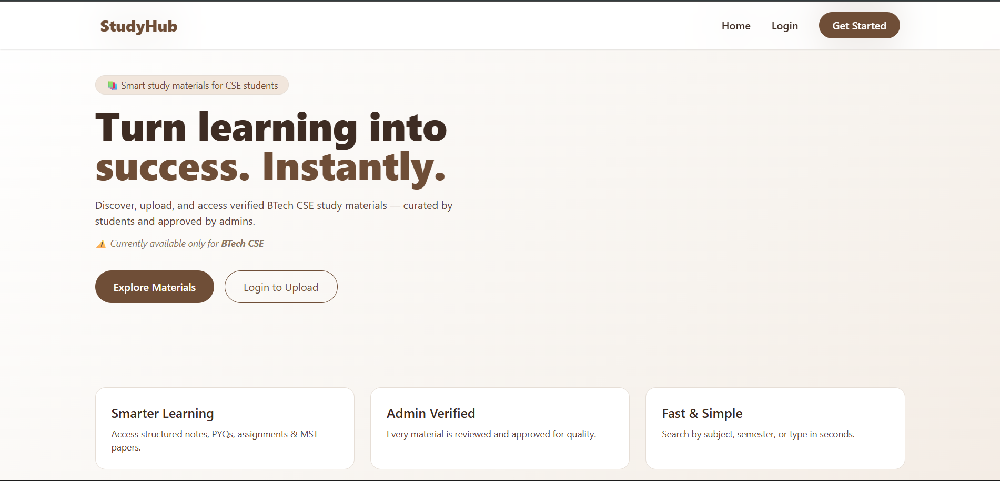
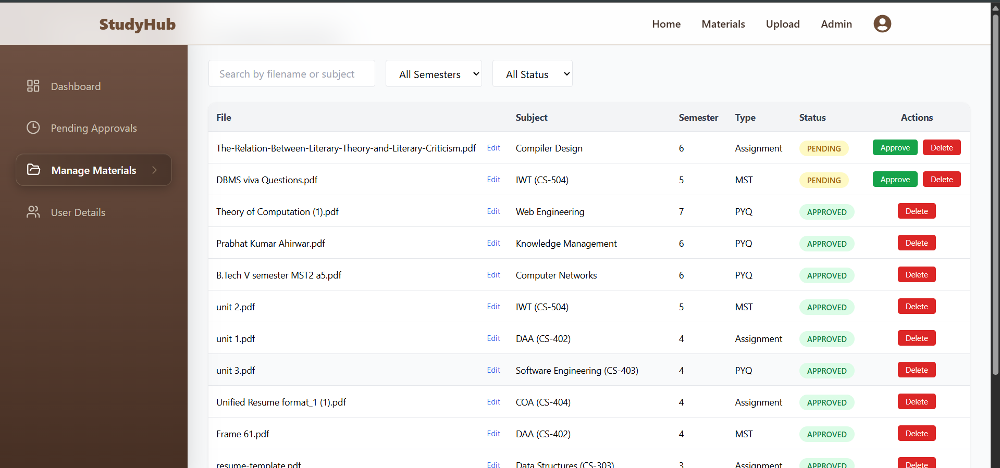
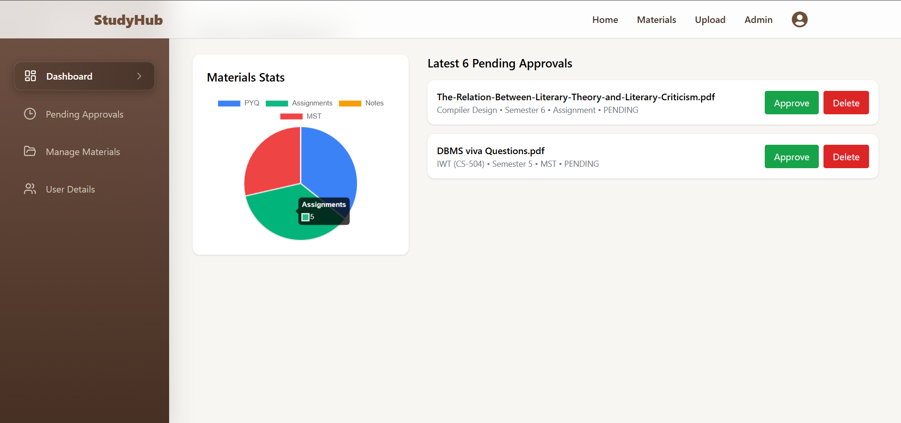
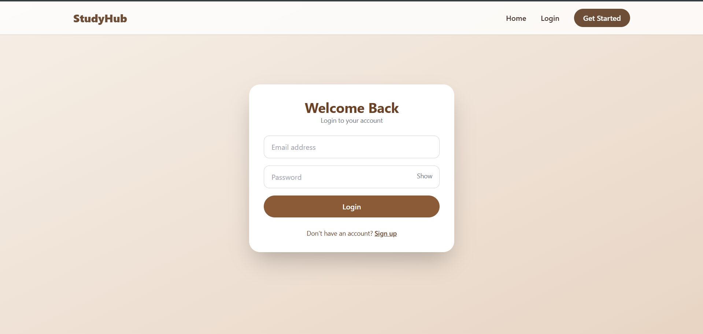
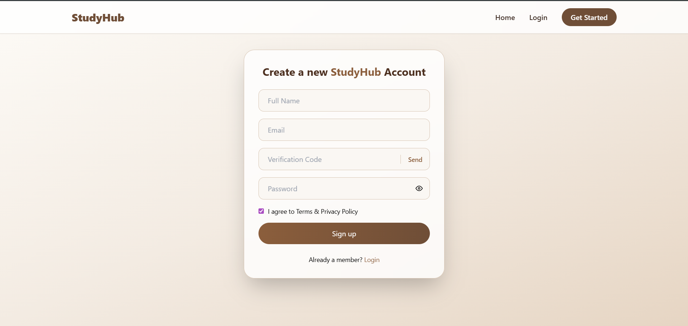
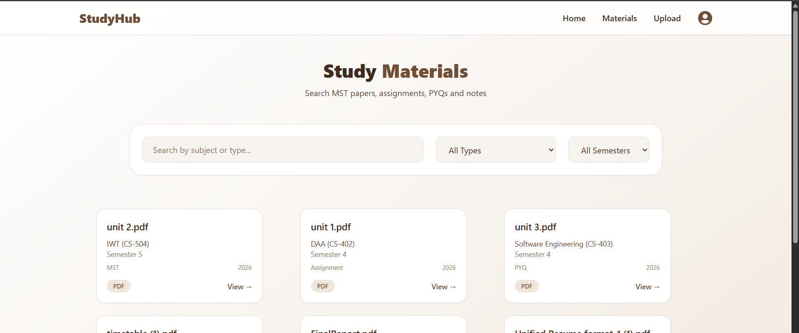
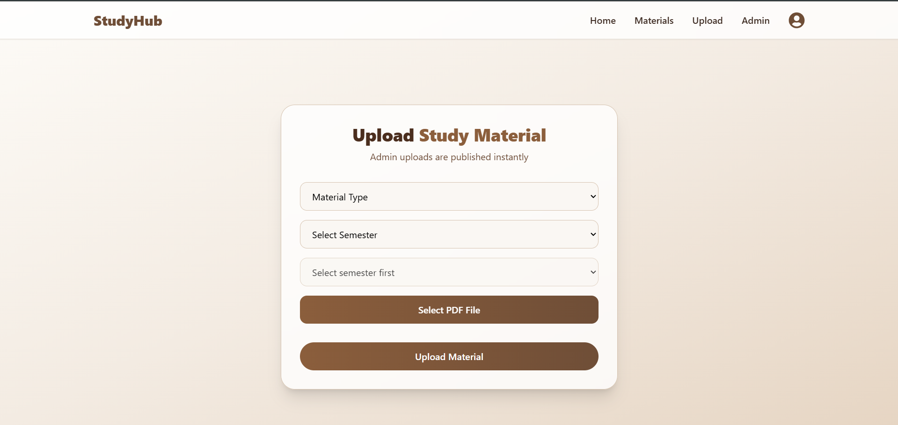

# Study-Hub

Study-Hub is a web platform for sharing study resources, managing notes, and collaborating with peers. It is built using Spring Boot, Spring Security, React, MongoDB.

---

## 🚀 Website Screenshots

### Home Page

### Dashboard

### Login 

### Signup 

### Resource Sharing

### Upload Page

---

## 💡 Features

- User authentication (Signup/Login)
- Upload and share study materials
- Interactive dashboard with resource management
- Profile customization
- Responsive design

---
